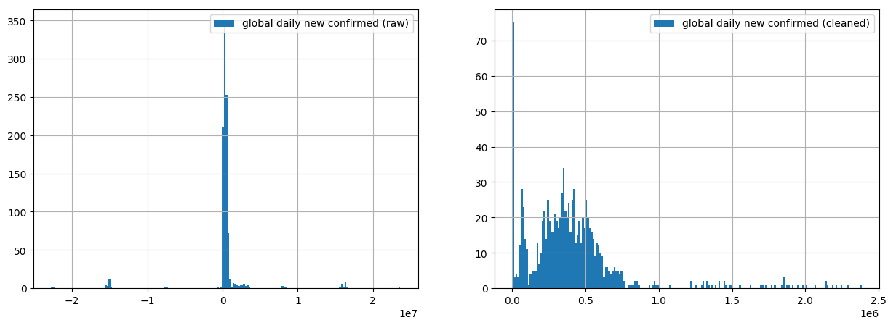
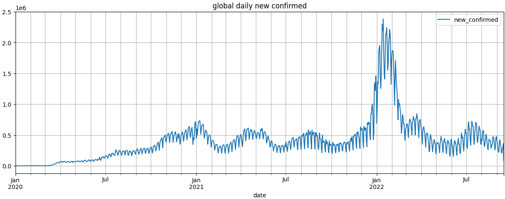
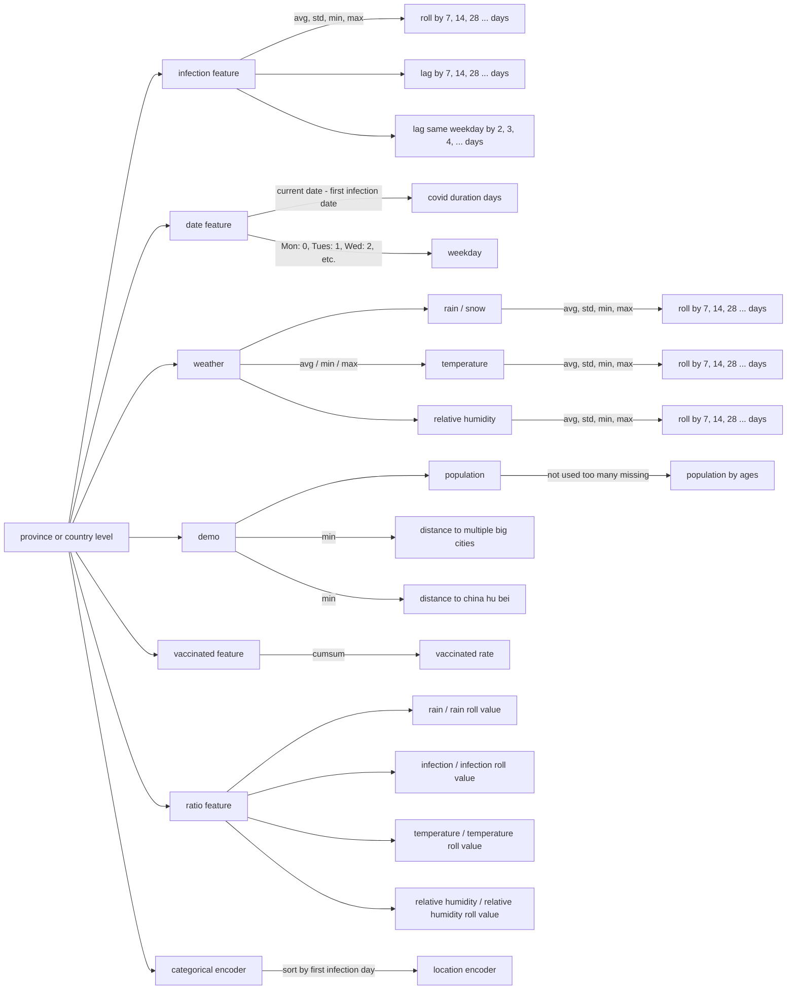
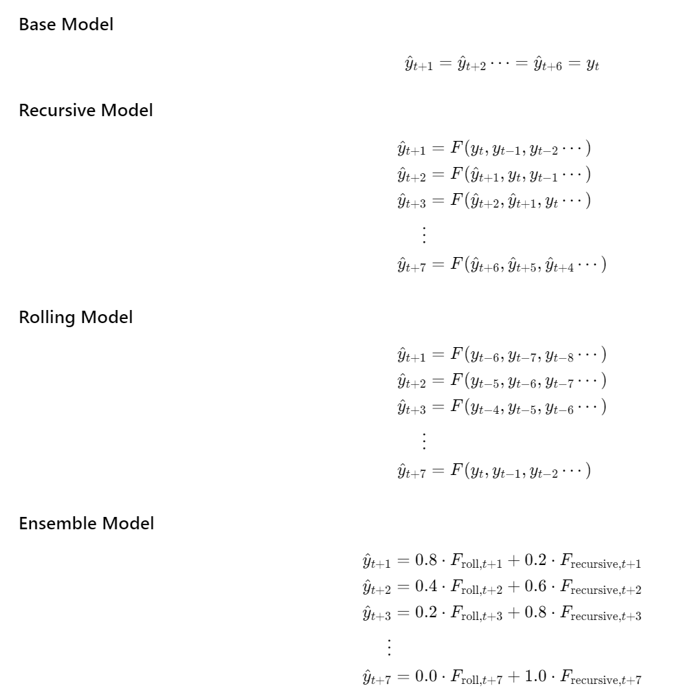
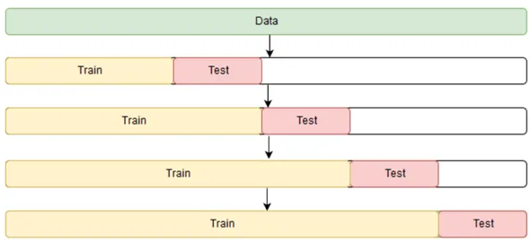
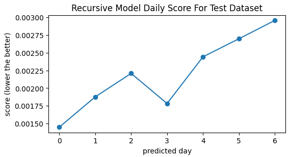
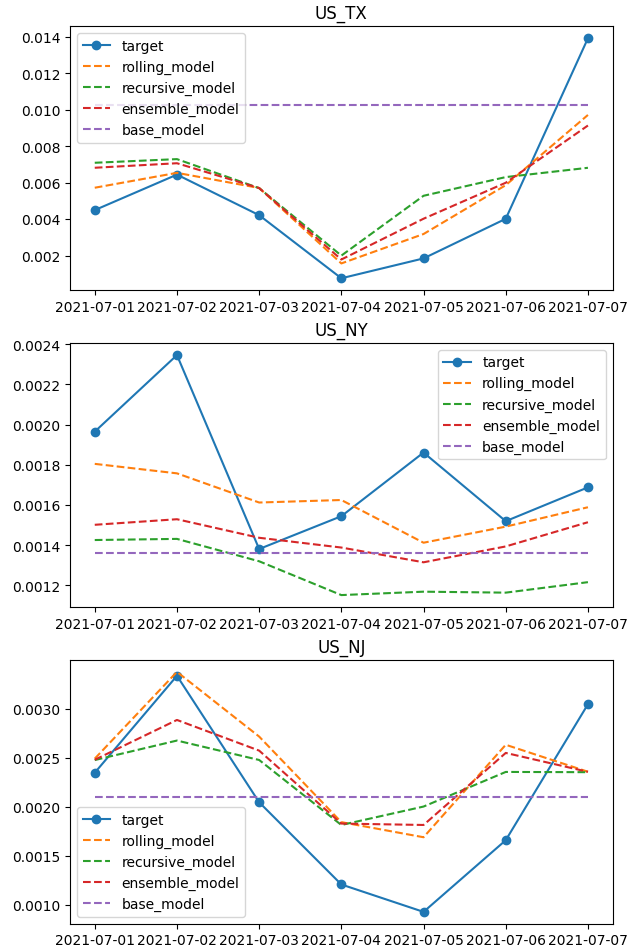
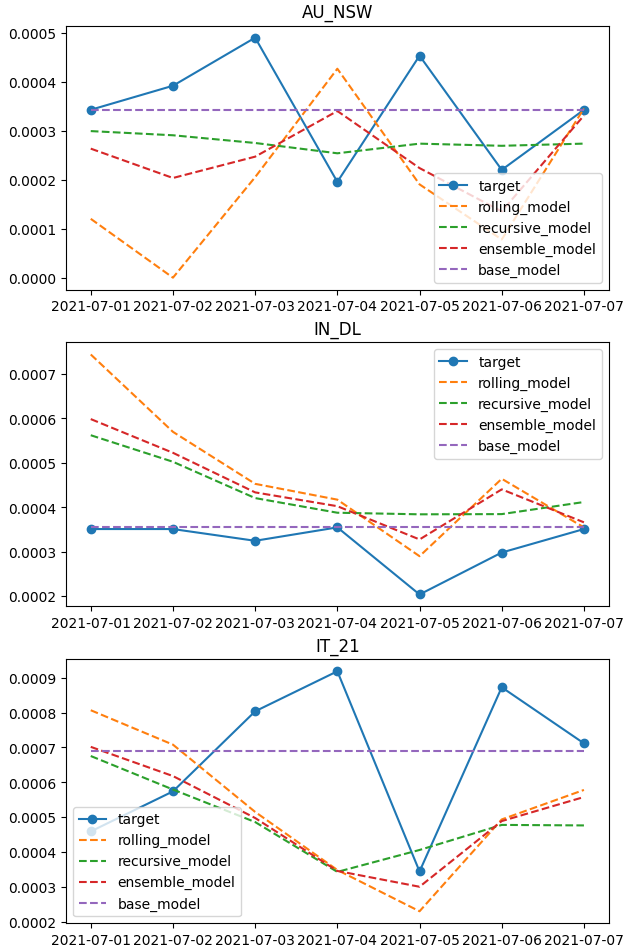
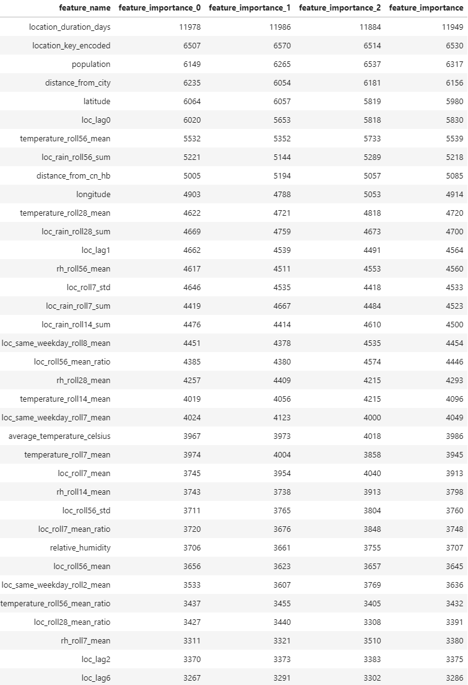

# About this project
This is a project to predict COVID infection rate in the next 7 days

# Docker 
1. `dockerfile` is used to build the docker
2. the container includes following important functionalities:
    - jupyterlab
    - deep learning `torch` + `cuda` support.
    - lightgbm + `cuda` support
    - requirements, such as `pandas`, `numpy`, `matplotlib`, etc.

<br>


# Dataset
## Download the dataset
1. Download dataset from Google COVID Open dataset:<br>
`!curl -o ./dataset/aggregated.csv.gz https://storage.googleapis.com/covid19-open-data/v3/aggregated.csv.gz`
2. the downloaded dataset is stored in the `./dataset` folder
3. Unzip the dataset using <br> `!gunzip ./dataset/aggregated.csv.gz`
4. use the function `src.util.split_dataset_by_level()` to split dataset by level and saving to the `dataset`

## Understand the dataset
1. The total dataset is 22G, in has many fields, below are the field used in the project:
    ```mermaid
        graph LR
            4[covid dataset] --> 5[new confirmed] & 6[new vaccinated]
            1[demographics]
            1 --> 2a["popultaion"]
            1 --> 2d["geolocation"]
            3[weather] -->3a[temperature] & 3b[rain & snow] & 3d[relative humidity]
            0[dataset] --> 4 & 1 & 3
    ```
2. the geolocation hierachy
    ```mermaid
    graph TB
        0[geoloation hierachy
          such as 
          US_CA_06085] -- start with level 0 --> 3a
        3a[country
            US] -- level 1--> 3b[province
                       CA] -- level 2--> 3c[county
                                Santa Clara with FIPS code of 06085] 
        3b -- level 3 --> 3d[locality / city
                                such as 
                                US_CA_SFO
                                ]
        3a -- level 3 --> 3d[locaility / city
                                such as
                                UA_KBP
                            ]
    ```
The raw dataset is around 22 GB. 
After keeping subset fields, the dataset volume by level is as below:
|level | storage (GB) | data size (M) | # of locations| Description |
|------|--------------|----------|----------------|------------|
| All  |  3.69        |  22.76   |  22,963        |  Combined  |
| 0    |  0.05        |   0.24   |     245        |  country   |
| 1    |  0.24        |   1.42   |   1,432        |  province  |
| 2    |  3.39        |  21.06   |  21,253        |   county   |
| 3    |  0.06        |   0.03   |      32        |  locality  |

__Based on the storage volume, Level 1 data is used for prediction based on__
 - 240MB data volume
 - 1,024 locations

## Target Variables
1.  `new_confirmed` outliers are removed
2.  the new infection rate is computed using `new_confirmed / population`


<br>


# COVID prediction Design

## Model ideas
* Use historical data to build a predictive model to predict the new COVID infection rates in the next N days

### Model Types
| Model Type   | Predicted days |  description |
| --------| -------------- |-------------------|
| Short   |     1 days     |  simple           |
| **Medium**  |   **7 days**     |  **used in this demo**|
| Long    |    30 days     |  challenging      |


## Reference date for this demo

* a reference date is the date to split time series train and split dataset
* the reference date in this demo is `2022-07-01`
* it gives enough history (up to `2021-06-30`) for training, and is able to do prediction starting from `2021-07-01`
* This reference date balances the training data and early prediction


## Evaluation Metrics
 - First option: Mean Absolute Error 
    - **MAE**= $\sum_{i=1}^n|y_i-\hat{y}_i|$
    - easy to interpret
    - less sensitive to large value outliers
- Improve: Assymetric Mean Absolute Log Error 
    - **MALE**= $\sum_{i=1}^n\left|\log(1+\hat{y}_i) - \log(1+y_i)\right|$
    - penalize underestimation more than overestimation, since underestimating can have severe consequences
    - handle zero and small values well
- Further Improve: Population Weighted MALE = ${1\over \sum_l^L w_l} \sum_{l=1}^L w_l \left(\sum_{i=1}^n\left|\log(1+\hat{y}_i) - \log(1+y_i)\right| \right)$


    ```mermaid
    graph TD
        0[location_key 0] & 1[location_key 1] & 1b[......] & 2[location_key L]
        0 -- all days--> 3[MALE 0]
        1  -- all days--> 4[MALE 1]
        2  -- all days--> 5[MALE L]
        1b  -- all days--> 6[...... ]
        3 & 4 & 6 & 5 --population weights--> 7[Score]
    ```
- More options to consider
  - multi-aggregation: daily averaged province ->  country --> final


## Feature Engineering

The features are built based on the ideas as below




## Model Design
| Model Name | Description |
| ---------- | ----------- |
| Base       | - use the lastest day infection rate as the predictions for the next 7 days <br> - produces a constant prediction
| Recursive  |- predict only the  next day, and then iteratively adds each prediction back into the training set for a total of 7 days. <br> - lose contextual information (weather, vaccine and other dataset) as iteration goes <br> - prediction decreases with each iteration.
| Rolling    |- predict values while maintaining a 7-day gap to allow rolling forecasts for 7 days ahead; <br> - the most valuable lastest 7-days data is exlucded in training, which may reduce the overall prediction accuracy
| Ensemble   |  Combine Rescusive and Rolling models



<!-- ### Base Model
$$
\hat{y}_{t+1} = \hat{y}_{t+2} \cdots  = \hat{y}_{t+6} = y_t
$$

### Recursive Model
$$
\begin{align*}
    \hat{y}_{t+1} &= F(y_t, y_{t-1}, y_{t-2} \cdots) \\
    \hat{y}_{t+2} &= F(\hat{y}_{t+1}, y_t, y_{t-1} \cdots ) \\
    \hat{y}_{t+3} &= F(\hat{y}_{t+2}, \hat{y}_{t+1}, y_t \cdots) \\
    \vdots \\
    \hat{y}_{t+7} &= F(\hat{y}_{t+6}, \hat{y}_{t+5}, \hat{y}_{t+4} \cdots)
\end{align*}
$$


### Rolling Model
$$
\begin{align*}
    \hat{y}_{t+1} &= F(y_{t-6}, y_{t-7}, y_{t-8} \cdots) \\
    \hat{y}_{t+2} &= F(y_{t-5}, y_{t-6}, y_{t-7} \cdots ) \\
    \hat{y}_{t+3} &= F(y_{t-4}, y_{t-5}, y_{t-6} \cdots) \\
    \vdots \\
    \hat{y}_{t+7} &= F(y_{t}, y_{t-1}, y_{t-2} \cdots)
\end{align*}
$$

### Ensemble Model
$$
\begin{align*}
    \hat{y}_{t+1} &= 0.8\cdot F_{\text{roll}, t+1} + 0.2\cdot  F_{\text{recursive}, t+1} \\
    \hat{y}_{t+2} &= 0.4\cdot F_{\text{roll}, t+2} + 0.6\cdot F_{\text{recursive}, t+2} \\
    \hat{y}_{t+3} &= 0.2\cdot F_{\text{roll}, t+3} + 0.8\cdot F_{\text{recursive}, t+3} \\
    \vdots \\
    \hat{y}_{t+7} &= 0.0\cdot F_{\text{roll}, t+7} + 1.0\cdot F_{\text{recursive}, t+7} \\
\end{align*}
$$ -->

## Overfitting
1. Apply time series Cross Validation. Find the smallest CV mean score, with the smallest standard deviation

    
2. Cross Validation Tuning 
   1. Round 1: Train model using all features
   2. Round 2: Keep top N features that explains X% of total feature importance; the best threshold X is obtained from the CV score and std. This is better than hardcode for top N features
   
3. Control overfitting in LightGBM parameters: `max_depth`, `subsample`, `max_bin`, `min_data_in_leaf`, `feature_fraction`, `n_estimators` etc. 

4. Seed averaged training. Once the tuning has been done, train multiple models with different seeds, and average the prediction

    ```mermaid
    graph TD
        0[all features] --round 1--> 0a --select features explained X% of feature importance --> 0b[subset features] --round 2--> 0c[Model Training] --> 0d[prediction 1]
        subgraph 0a[Model Training]
            0aa[seed 1] --> 0ab[lightgbgbm]
        end
        subgraph 0c[Model Training]
            0ca[seed 1] --> 0cb[lightgbgbm]
        end
        0 --round 1--> 1a --select features explained X% of feature importance --> 1b[subset features] --round 2--> 1c[Model Training] --> 1d[prediction 2]
        subgraph 1a[Model Training]
            1aa[seed 2] --> 1ab[lightgbgbm]
        end
        subgraph 1c[Model Training]
            1ca[seed 2] --> 1cb[lightgbgbm]
        end
        0 --round 1--> 2a[Model Training] --select features explained X% of feature importance --> 2b[subset features] --round 2--> 2c[Model Training] --> 2d[prediction 3]
        subgraph 2a[Model Training]
            2aa[seed 3] --> 2ab[lightgbgbm]
        end
        subgraph 2c[Model Training]
            2ca[seed 3] --> 2cb[lightgbgbm]
        end
        0d & 1d & 2d --> 3[averageed prediction]
    ```


## Model Performance
| Model Name | CV Score (Mean) |  CV Score (Std)  | Test |
| ---------- | -----------     | ---------------- |------|
|  BASE      |   0.0032        |    0.0004        |0.0029|
|  ROLLING   |   0.0022        |    0.0002        |0.0022|
|  RECURSIVE |   0.0022        |    0.0006        |0.0022|
|  Ensemble  |   ---           |    ---           |0.0019|

Why ensemble work?



The performance<br>



## Feature Importance Analysis
Take the rolling model as an example:



 - `duration_days`: represent the current stage of the COVID life cycle
 - `population`: propotional to the population density, higher values indicate a greater likelihood of infection spread
 - `distance_from_city`: reflect the impact of transportation on COVID spread. Areas closer to a large city (ot the city itself) typically show higher infection rates based on the life cycle stage indicated by `duration_days`
 - `latitude`, `56 day mean temperature` and `56 day total rainfall mm`: these variables reflect the indirectly / directly influence of weather conditions. Tropical regions with lower latitudes, have higher temperature and more rainfalls; regions with higher latitude regions and low temperature are more susceptible to COVID infection due to poor indoor air circulation
- `loc_lag0`: refers to the value at the last available date, plays the same role as the base model despite a 7-day gap. 
- All these top features are logically consistent and meaningful

## What does not work
I also tested some other ideas, but it does not work, including
1. Build country-level models, these models are over-fitting, with most important features being rainfall features. 
2. Recursive models have much less features than the roll model, therefore the same `n_estimator = 3000` leads to overfitting for day 1 and very bad performance for day 5, 6, 7
3. TBA

# Engineering Work
1. all **source code** are in the `/src` folder
   1. **features** is in the `/src/features.py`
      1. all features are written in the separate classes having a `transform` method
      2. some features may have a `fit` method
      3. this design allows a simple feature `transform` piepeline
   2. **model** source code is in `src/models.py`
   3. **unit test** source code is in `src/tests/` folder (demo purpose only)
   4. **logging** source code is in `src/logging_config.py`
   5. **ultilities** functions, including `train_test_split` are in `src/util.py`
2. **models** 
   1. models are also written in the class having a `fit` and `transformer` method
   2. models are saved in the `/models` folder, all 3 models are included
   3. models are saved using `joblib`
3. predictions are saved in the `/predictions` folder using the reference date `2021-07-01`
4. **scores** are saved both in notebook and `/scores` folder
5. **datasets** are in the `/dataset` folder. Due to the data size, some dataset may not be available in the github, but you can refer to the instruction above to download and process dataset by yourself.
6. **unit test** uses `pytest` . Due to the time limit, test is for demo only
7. **`logging`** are included for all of the features and models
8. **driver** codes are all in the **Jupyter notebooks**. The output are saved to allow compare the model CV performance 
9. **config** are in the `config.json`
10. **dockerfile** is in the `dockerfile`

<br>

# Future Work
There are much more work than I thought at the beginning. The more I worked on this project, more ideas and more implementation I wish to finish. It is not perfect, there are still lots of space to improve

1. prediction at the country level
2. try other models, including neural networks, such as using attention & transformer infrastructure
3. build a prediction API to allow easy access
4. build a map dashboard to visualize the prediction in the map
5. use other infection data to pre-train the model
6. and more. 